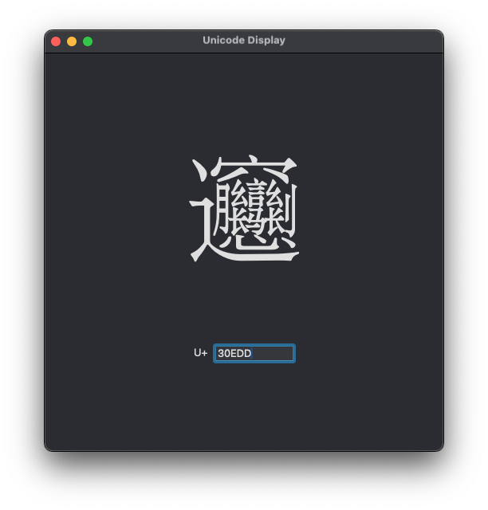

# ``Unicode Display``

This project allows entry of a Unicode code point and displays the relavent character, while
displaying the UTF encodings and byte size.

## Overview

Intended to work with UTF-8 and UTF-16 encodings. I hope to be able to add ability to input a 
character literal and display the code point and encodings as well.

<!--## Topics-->

### <!--@START_MENU_TOKEN@-->Group<!--@END_MENU_TOKEN@-->

- [Converter](file:../Converter.swift)
